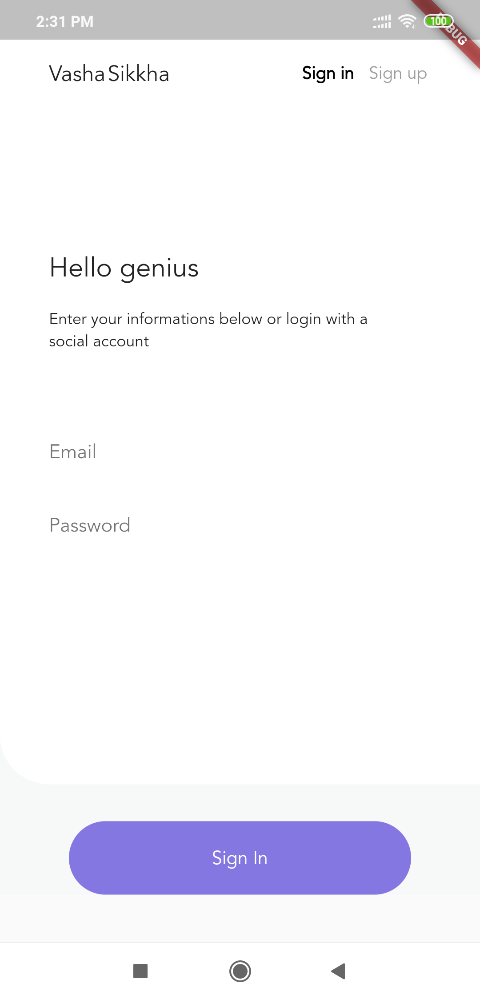
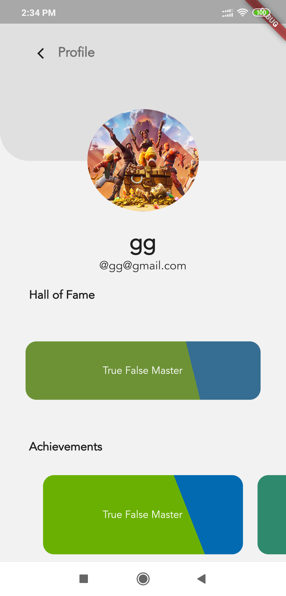
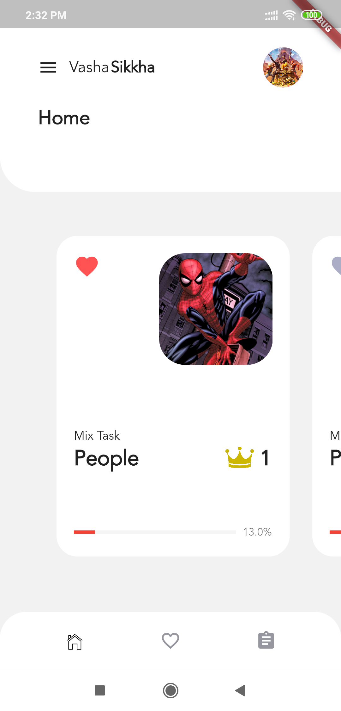
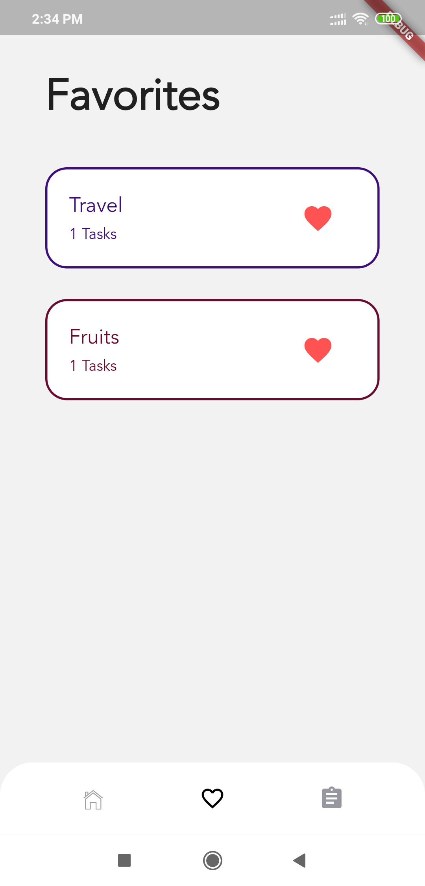

# Vasha-Sikkha
An application that helps you learn English in a very interactive way.

In this app, you can practice speaking, reading, listening and writing. You can progress through the app by completing lessons. Starting with the basics, you can move on to more advanced topics later. By registering an account, you can can choose from a number of different lessons which will be categorized in the app.Each lesson will contain predefined number of tasks. For beginners, easier tasks will be assigned. As the user progresses through our application, we will use his/her data to suggest tasks accordingly.On completing a lesson, user score will be updated, and he/she can view his/her ranking in the leaderboard. We will use user historical data to suggest tasks. Each time a user practices a lesson he/she will always get different tasks.

User scores are saved in database, and a combined leaderboard of all users can be seen from the app. This increases competitiveness amongst the users

## Features
		1.  Fill in the blanks with correct letter
		2. Fill in the blanks with correct word
		3. Sentence Matching(Bangla and English)
		4. Sentence Matching(English sentence)
		5. MCQ 
            6. Memory game
		7. Cross Word Puzzle
		8. Jumbled sentence

Here are some screenshots from the app.
## Login Page

## Profile Page

## Task Page

## Quiz Task Page

## Favourites Page

## Fill in the Gaps

## Jumbled Sentence

## Jumbled Sentence

